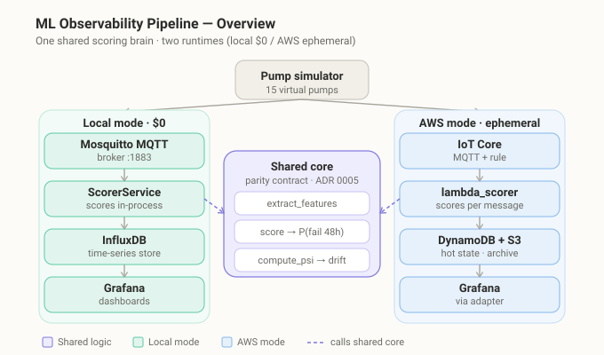
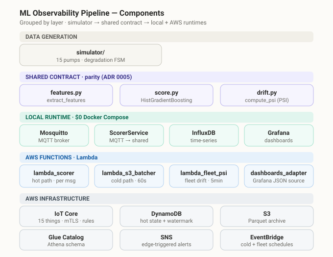
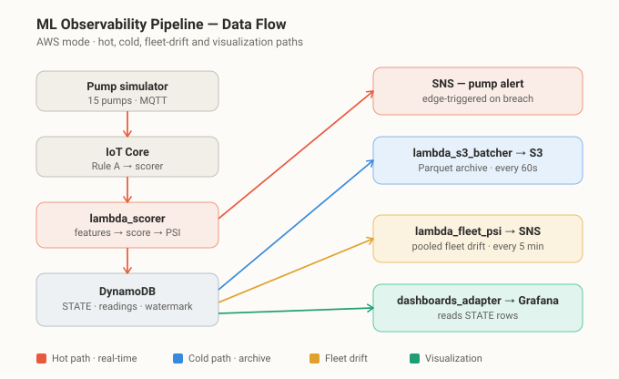

<div align="center">

# ML Observability Pipeline

### Real-time failure scoring & drift detection for a fleet of industrial pumps

**One shared scoring core. Two runtimes — a $0 local stack and an ephemeral AWS deployment.**

[](https://github.com/AdarGit008/ml-observability-pipeline/actions/workflows/ci.yml)
[](#testing)
[](LICENSE)
[](#quickstart--local-mode-0)
[](#cost)
[](docs/adr)



</div>

---

## What this is

A production-shaped MLOps pipeline that monitors a **simulated fleet of ~15 industrial pumps**. It
streams telemetry over MQTT, scores each pump's probability of failure with a gradient-boosted model,
and watches for **data/model drift** before it quietly degrades predictions.

The same scoring and drift logic runs in two places:

- **Local mode** — Docker Compose (Mosquitto + InfluxDB + Grafana). Always-on, **$0**.
- **AWS mode** — IoT Core → Lambda → DynamoDB + S3, visualized in Grafana. Spun up for a demo, then torn down.

A `shared/` package is the **single source of truth** for feature engineering, scoring, and PSI drift, so
both runtimes are guaranteed to behave identically (enforced by a test, [ADR&nbsp;0005](docs/adr/0005-shared-mode-parity-package-and-subscriber-topology.md)).

Three built-in scenarios demonstrate the system end to end: **seasonal drift**, **fleet expansion**, and a **real failure**.

> **Why it's built this way.** Every choice is bounded by three hard constraints — **$0 lifetime AWS cost**
> (credits + teardown, no legacy free tier), **a single PC** (no spare hardware), and **strict mode parity**
> (local and cloud share one scoring brain). Those constraints, not the happy path, are where the
> engineering lives. Decisions are written down as [18 ADRs](docs/adr).

---

## Highlights

| | |
|---|---|
| **One scoring brain, two runtimes** | `shared/{features,score,drift}.py` is a locked parity contract; a structural test forbids vendoring it into either runtime. |
| **Real drift detection** | Population Stability Index (PSI) over raw signals, with a **warm-up gate** ([ADR&nbsp;0017](docs/adr/0017-psi-warmup-gate.md)) so cold starts don't false-alarm. |
| **Fleet-wide drift** | A pooled, plant-wide PSI Lambda on a 5-minute EventBridge schedule ([ADR&nbsp;0018](docs/adr/0018-fleet-psi-eventbridge-lambda.md)). |
| **Edge-triggered alerts** | SNS fires once on a threshold *crossing*, not every breached message ([ADR&nbsp;0012](docs/adr/0012-edge-triggered-sns-alerts.md)). |
| **Hot + cold paths** | Hot: score → DynamoDB. Cold: batch → Parquet → S3 + Glue catalog ([ADR&nbsp;0015](docs/adr/0015-cold-path-batcher-watermark-pyarrow-cadence.md)). |
| **Infrastructure as code** | The entire AWS side is Terraform — IoT Things, Lambdas, DynamoDB, S3/Glue, EventBridge, SNS. |
| **Tested & reviewed** | **454 passing tests**; every change goes through a recorded, scripted code review ([ADR&nbsp;0011](docs/adr/0011-multi-provider-review-cascade.md)). |

---

## Quickstart — local mode ($0)

**Prerequisites:** Docker (Compose v2) and Python 3.11+.

```bash
# 1. Bring up local infra — broker + InfluxDB + Grafana (all Docker, $0)
docker compose up -d

# 2. Create your local configs from the checked-in examples
cp simulator/config.example.yaml      simulator/config.yaml
cp local_runtime/config.example.yaml  local_runtime/config.yaml

# 3. Install Python deps (a venv is recommended)
python -m venv .venv && source .venv/bin/activate   # Windows: .venv\Scripts\activate
pip install -r requirements.txt

# 4. Tell the runtime which InfluxDB token to use (see docker-compose.yml)
export INFLUX_TOKEN=ml-obs-local-token              # PowerShell: $env:INFLUX_TOKEN = "ml-obs-local-token"

# 5. Start the simulated fleet, then the scorer
python -m simulator &        # publishes telemetry for 15 pumps
python -m local_runtime       # subscribes, scores, writes to InfluxDB
```

Then open the dashboards at **http://localhost:3000** (anonymous admin — no login).
You should see scored rows land within a few seconds. Tear down with `docker compose down`.

---

## How it works

The simulator is the single data source; everything downstream calls the same `shared/` core. The local
and AWS runtimes are mirror images — only the transport and storage differ.

<div align="center">

</div>

In AWS mode, telemetry fans out into four color-coded paths — a real-time hot path, a batched cold
path, fleet-wide drift, and visualization:

<div align="center">

</div>

---

## AWS mode (ephemeral demos)

AWS mode is **apply → demo → destroy**, never left standing. The full sequence — pre-flight, build,
apply, simulate, observe, teardown — is the [AWS demo-day runbook](docs/runbooks/aws-demo-day.md).

<details>
<summary><b>The short version</b></summary>

```powershell
# Build the four Lambda bundles (repo root)
.\scripts\build_lambda.ps1; .\scripts\build_adapter.ps1; .\scripts\build_batcher.ps1; .\scripts\build_fleet_psi.ps1

# Apply (region eu-central-1)
cd infra
cp terraform.tfvars.example terraform.tfvars   # set alert_email
terraform init
terraform apply                                # review the plan, then approve

# Run a demo against IoT Core, watch Grafana via the adapter Function URL, then ALWAYS:
terraform destroy                              # or: bash scripts/aws_teardown.sh
```

Provisions IoT Core (mTLS Things + rule), `lambda_scorer`, `lambda_s3_batcher`, `lambda_fleet_psi`,
the `dashboards_adapter` Function URL, DynamoDB, S3 + Glue catalog, EventBridge schedules, and SNS.
</details>

### Cost

Local mode is genuinely **$0** — it never touches AWS. AWS mode runs on **on-demand billing covered by
account credits**: a full demo runs well under **$0.20** — measured around **$0.01** in practice (IoT Core inside the 12-month free tier;
DynamoDB on-demand per [ADR&nbsp;0013](docs/adr/0013-dynamodb-on-demand-billing.md); S3/Glue/EventBridge are noise). Teardown after every demo keeps standing cost at zero.

---

## Repository map

| Path | What lives here |
|------|-----------------|
| [`simulator/`](simulator) | Async pump-fleet simulator — telemetry over MQTT, three drift scenarios. |
| [`shared/`](shared) | **The parity core**: `features`, `score`, `drift` — shared by both runtimes ([ADR&nbsp;0005](docs/adr/0005-shared-mode-parity-package-and-subscriber-topology.md)). |
| [`model/`](model) | Training pipeline + committed model artifacts (held-out AUC ≈ 0.997). |
| [`local_runtime/`](local_runtime) | Local-mode consumer: subscribe → score → InfluxDB. |
| [`lambda_scorer/`](lambda_scorer) | AWS hot path: score per message → DynamoDB, edge-triggered SNS alert. |
| [`lambda_s3_batcher/`](lambda_s3_batcher) | AWS cold path: DynamoDB → Parquet → S3 (Glue table). |
| [`lambda_fleet_psi/`](lambda_fleet_psi) | Pooled, plant-wide drift Lambda on an EventBridge schedule. |
| [`dashboards_adapter/`](dashboards_adapter) | AWS Function URL that feeds Grafana via the Infinity datasource. |
| [`dashboards/`](dashboards), [`grafana/`](grafana) | Grafana dashboards + provisioning-as-code. |
| [`infra/`](infra) | Terraform for the entire AWS deployment. |
| [`docs/`](docs) | [ADRs](docs/adr), [diagrams](docs/diagrams), [runbooks](docs/runbooks), session logs. |
| [`scripts/`](scripts) | Lambda build scripts + the code-review tooling. |

---

## Testing

```bash
pip install -r requirements.txt -r requirements-dev.txt
python -m pytest
```

**454 passing tests** (one extra runs only on Python 3.12+). They are pure unit tests — AWS is faked with
[`moto`](https://github.com/getmoto/moto) and `monkeypatch`, so **no Docker, AWS account, or network is
required**. A fresh clone passes out of the box because the model artifacts are committed. The same
command runs in [CI](.github/workflows/ci.yml) on every push.

---

## Design decisions

Eighteen [Architecture Decision Records](docs/adr) capture the *why* behind every non-obvious choice — a
few worth skimming:

- [ADR 0005](docs/adr/0005-shared-mode-parity-package-and-subscriber-topology.md) — the shared mode-parity contract
- [ADR 0007](docs/adr/0007-psi-implementation-and-cadence.md) — PSI implementation & cadence
- [ADR 0010](docs/adr/0010-dynamodb-schema-hot-state.md) — DynamoDB hot-state schema
- [ADR 0012](docs/adr/0012-edge-triggered-sns-alerts.md) — edge-triggered SNS alerts
- [ADR 0016](docs/adr/0016-iot-fleet-provisioning-cert-custody.md) — IoT fleet provisioning & cert custody

---

## Tech stack

**Python** · scikit-learn (HistGradientBoostingClassifier) · NumPy · PyArrow · aiomqtt/MQTT ·
**AWS** IoT Core · Lambda · DynamoDB · S3 + Glue · EventBridge · SNS · **Terraform** ·
**Grafana** · InfluxDB · Docker Compose · pytest · moto

---

## License

[MIT](LICENSE) © 2026 Adar
